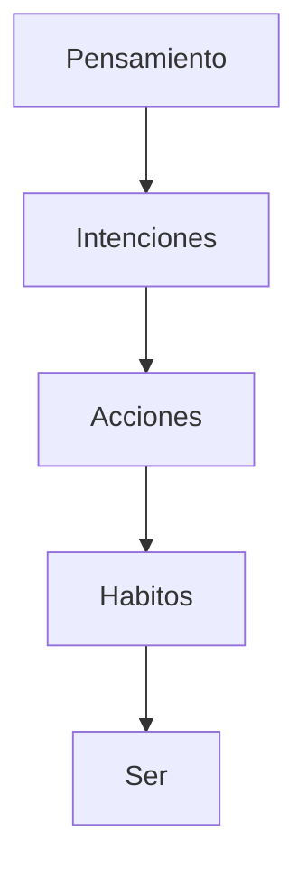

**Tags:** #_Done
**MetaTags:** #SaberesDeLaVida #ToLink
- - -
"El carácter se define como la manera de ser actuar y pensar del ser humano."  

"El pensamiento condiciona la acción, 
la acción determina el comportamiento,
el comportamiento repetido crea habitos,
los habitos estructuran el caracter 
y el caracrer marca el destino"

Esta es la cadena que a través del tiempo forja nuevas formas del ser.

Pensamientos , Intenciones , accioones , habitos , y acaban siendo parte de ti

  
- - - 
## ***Sources:***